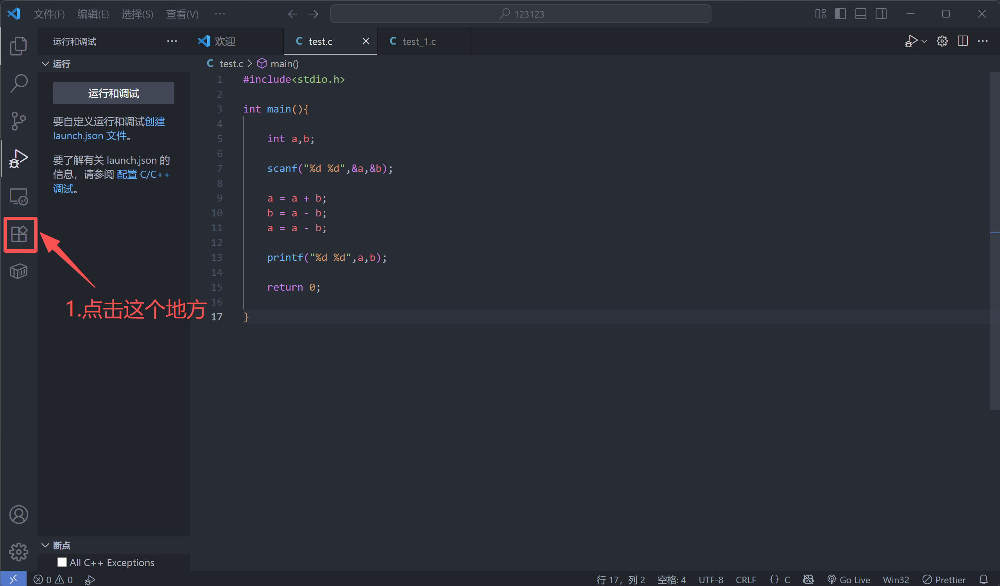
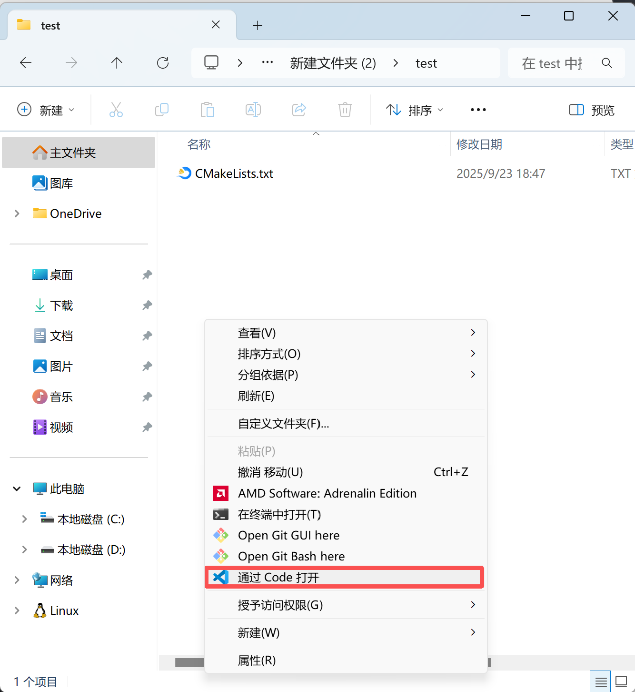

# CMake for VScode简单教程

（在VScode，C语言怎么运行？今儿给您来个保姆级的教程）

## 使用说明

​	本教程旨在提供一个在VScode上面顺利运行c/c++程序的方法，避免运行时的各种bug。如果不想太过麻烦，可以直接使用Devc++，Devc++安装包和使用教程网上就有，故本仓库不额外提供。

​	此外，本教程没有提到的一切问题都不重要（对于运行C语言程序及设计这门课所需要用到的代码来说），因为本教程是一份实践教程而非理论教程，最终目的是让c在VScode上跑起来（只要程序能跑起来，bug什么的都无所谓对吧）。

​	当然，可能存在一些没有提及的bug，在github的issue区域反馈或者直接联系作者即可，这对完善这份教程来说很重要QwQ

## 适用人群

​	在vscode上面编译运行c/c++时总会遇到各种奇奇怪怪bug但又懒得解决这些问题的同学

## 你需要准备

​	一台windows系统的电脑（以下将以win11为例），并安装了VScode（直接上网搜就能搜到，注意不要从各种奇怪的软件站下载，要从官网下载）

​	（mac也可以尝试使用本教程，不过由于本人没有一台mac做测试用，所以并不清楚本教程对于mac的适配程度，如果mac尝试失败了可以问问无所不能的大模型）

## 操作步骤

### Step 1 ： ~~打开VScode~~ 安装一些插件




​	下面是你需要安装的插件：
​		1.C/C++ Extension Pack

​		2.CMake Tools

​		3.Chinese (Simplified)（对自己英语有自信的同学可以不安装QwQ）

### Step 2 ： 安装CMake

1.点击下面这个超链接或将这个地址复制到浏览器的网址处（怎么复制到网址处应该不用教...吧？）

（好像访问这个网站需要魔法，如果想要体验从网站上下载文件乐趣的同学请自备工具，或者直接使用download文件夹下的安装包）

<a href = "https://cmake.org/download/">https://cmake.org/download/</a>

2.然后就可以点击下载安装包了


​	（很多Windows系统的电脑现在都是x64，直接点这个就好；如果你的电脑是arm64，那就下载下面那个给ARM64用的安装包就好。具体怎么判断你的电脑到底属于哪一种，请上网自己查教程捏QwQ）

​	（如果你使用的是download文件夹下的安装包的话，可以通过文件名来判断是哪个安装包，文件名中包含arm64的是arm64的安装包，另一个是x64的）

3.双击安装包下载CMake

​	是的，你刚才下载的只是CMake的安装包，真正的CMake需要你通过安装包获取

​	你需要接受CMake的协议，然后==**一定一定一定**==要将CMake添加到环境变量中，也就是==**选中红色箭头指向的这个框框**==


​	图方便的话不需要修改安装位置，不过一般也不推荐修改安装位置就是了，如果不把CMake放在C盘的话可能会出现一些bug


​	然后接下来一直点next或者install就行了

​	这样CMake就安装好了


### Step 3 ： 下载一个编译器并将其添加到环境变量中（以MinGW为例）

​	（如果对什么是编译器感到困惑，请善用搜索。本教程中，你只需要知道我们需要编译器就好了）

​	这个网站不用魔法也可以访问

​	<a>https://sourceforge.net/projects/mingw-w64/files/Toolchains%20targetting%20Win64/Personal%20Builds/mingw-builds/8.1.0/threads-posix/seh/</a>

​	进去之后点击网页里面那个<span style="color: blue;">蓝色的**x86_64-8.1.0-release-posix-seh-rt_v6-rev0.7z**</span>就可以下载鸭嗦包了。（或者直接使用作者在download文件夹中给出的鸭嗦包）MinGW的安装需要你找一个地方，把这个鸭嗦包解压到那个地方。**解压后不要着急关掉鸭嗦包解压后文件夹所在的窗口**。接下来，我们需要**将 MinGW 的 `bin` 目录添加到系统环境变量中。**

​	在开始菜单搜索“环境变量”。


​		点击“编辑系统环境变量”。


​	在弹出的窗口中点击“环境变量”。


​	在“系统变量”下，往下翻找到 `Path` 变量（只看前面的变量，后面的值每个人都不一样）双击。


​	回到刚才没有关闭的那个Mingw64文件夹，进入里面的bin文件夹后，点击上面的小框框，复制这个框框里面的一串字符（即该文件夹的“路径”）

​	

​	点击“新建”，粘贴咱们刚才复制的 MinGW 的 `bin` 目录路径，例如 `D:\mingw64\bin`。


​	一路点击“确定”保存。

​	（这里就不放图片了，好几个“确定”还是比较显眼的，点就好了）

​	接下来我们验证一下咱们刚才干的工作是否成功：

​	按`win+R`，会弹出一个窗口，如果这个窗口里面的文字不是`cmd`，那就改成`cmd`，然后点“确定”


在弹出来的这个黑框框里面输入`gcc --version` 和 `g++ --version`。如果成功显示版本信息，说明安装成功。（如下图）


### Step 4 ： 在 VS Code 中配置和构建项目

​	gxgx（恭喜恭喜），你已经完成了前期繁琐的准备工作，可以到此为止了（bushi

​	接下来我们需要再做一点小小的工作，来让我们的程序能够真正运行起来

​	如果你想使用这个教程的方法完成你的第一个C程作业，请先创建一个文件夹，为了和教程同步，建议命名为```test```，并在这个文件夹中创建一个名为```CMakeLists.txt```的文件，就像下面这样：

```
\---test
        CMakeLists.txt
```

​	上面的文字表示在名为test的文件夹中，有一个名为```CMakeLists.txt```的文件，这种表示方法也叫目录树，是一种常见的表示文件夹结构的方法

​	接下来，请将下面这段代码复制到你刚刚创建的```CMakeLists.txt```文件中，记得要保存

```
cmake_minimum_required(VERSION 3.10)
//从这里开始
project(asm_0)
//到这里，是第一处需要修改的地方
set(CMAKE_CXX_STANDARD 11)
set(CMAKE_CXX_STANDARD_REQUIRED True)
set(CMAKE_CXX_EXTENSIONS OFF)
//从这里开始
add_executable(asm_0 asm_0.cpp)
//到这里，是第二处需要修改的地方
```

​	保存好刚才的文件后，让我们通过VScode打开这个文件夹。

​	请右键这个文件夹的空白位置，点击**通过code打开**（也就是下图红框框出来的部分）



​	p.s.图中的右键菜单是win10风格，我个人比较喜欢，因为一次性就能把所有的选项显示出来。大部分同学的电脑应该是win11系统，右键菜单默认是win11风格，可能需要再点一次才能显示全部选项。如果想要换成win10风格，您猜怎么着，还是请善用搜索QwQ

​	**（请忽视底下这个图片的提示，不要点击那个地方）**


​	打开后，你会惊讶的发现，欸，上面居然自动弹出来了一堆选项，这是由于VScode检测到该文件夹中有```CMakeLists.txt```而特别显示的。不过我们**先不理他**，先复习一下C程第一节课的内容，写一个程序输出Hello World。让我们创建一个名为```test.c```的文件，在这个文件中完成这个小任务


​	（对照下图来检查一下自己有没有写对吧，如果写错的话VScode也会提示你的QwQ）


​	然后让我们从左边侧栏点击```CMakeLists.txt```，编辑一下这个文件


​	接下来让我们关注一下该文件中注释的部分。

​	第一处需要修改的地方有一个括号，括号里面的内容按照需要来修改。如果你想给你的第一份作业的第三份代码用这个方法运行，那么可以修改为```assignment_1_3```，不过这里我们是为了测试一下CMake这个方法，所以请修改为```test```

​	第二处需要修改的地方也有一个括号，括号里面的内容也得修改。请将其修改为```test test.c```

​	虽然本教程非常不想引入理论，不过为了说清楚这两处修改的原理以方便同学们以后使用CMake更方便，很遗憾我们要上一个小课了：
​	`project(asm_0)`：这里设置了项目的**名称**。CMake 在生成构建文件（如 Visual Studio 的 `.sln` 文件或 Makefiles）时会使用这个名称。

​	`add_executable(asm_0 asm_0.cpp)`：这行定义了一个可执行文件。括号里的第一个 `asm_0` 是你希望生成的可执行文件的**目标名**。这个目标名会被用来生成最终的可执行文件（例如 `asm_0.exe`）。

​	看不懂吗？~~那就对了~~无所谓，其实这里想要说明的是：两个```test```（不包括```test.c```的那个test）的位置的文本最好像本教程一样写成一样的，后面```test.c```处，视你的```.c```文件叫什么，如果叫```chaojiwudibaozhalihaiyuzhoudiyichengxu.c```的话，那就用这个“超级无敌爆炸厉害宇宙第一程序”的超长名字来替换```test.c```

​	好了，现在基本的内容我们都完成了，但我们的程序还是没有跑起来对莫QwQ

​	为什么呢？

​	想想我们跳过了哪一步。

​	是的，刚刚进入VScode时弹出的那一堆选项我们没有选。

​	所以让我们关掉VScode（关掉VScode前请确认保存了刚才的所有修改），像刚才那样从右键菜单进入VScode。现在，由于检测到你的文件夹中有```CMakeLists.txt```这个文件，CMake就会提示你可以构建项目，请点击下面专门指出来的地方。如果不小心把这个提示框给搞没了，请点击左下角框出来的“生成”，这样提示框就会又出来了QwQ

​	

​	如果你前面的步骤都没有问题，那么这里会非常丝滑没有报错地给你把项目生成了，注意看左边的文件栏，里面多了一个`build`文件夹。

​	现在，就是最激动人心的一步了！让我们点击左下角的这个小三角


​	成功输出了Hello World！

​	wow！

​	恭喜你成功完成了第一个用CMake运行的C语言项目，在以后的日子里，你只需要把```CMakeLists.txt```文件复制到新的文件夹下面，把里面的内容修改好，按照今天的流程点点点，那么你的C语言项目就会运行得无比丝滑，当你的同学还在因为各种不同的问题导致的无法编译而焦头烂额时，你只会端着一杯咖啡在旁边云淡风轻地想起这个你开始使用CMake而你的同学由于嫌配置麻烦而拒绝使用CMake的早上/中午/下午/深夜。

​	gxgxQwQ

​	看到这里，能不能麻烦你动动仁慈的小手，给作者的github仓库点一个小星星，就当是学习CMake的学费呢，在此先感谢你啦QwQ
